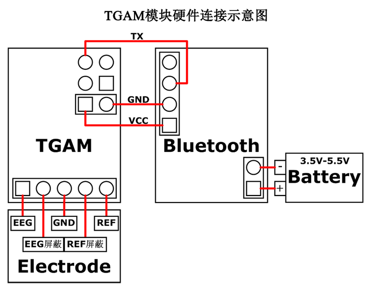

# MindViewer

使用TGAM模块的脑电波可视化工具

- [MindViewer](#mindviewer)
  - [准备](#%e5%87%86%e5%a4%87)
  - [TGAM技术参数](#tgam%e6%8a%80%e6%9c%af%e5%8f%82%e6%95%b0)
    - [通用参数](#%e9%80%9a%e7%94%a8%e5%8f%82%e6%95%b0)
    - [I/O脚](#io%e8%84%9a)
    - [ThinkGear编码](#thinkgear%e7%bc%96%e7%a0%81)
    - [命令字节](#%e5%91%bd%e4%bb%a4%e5%ad%97%e8%8a%82)
    - [可配置默认设置](#%e5%8f%af%e9%85%8d%e7%bd%ae%e9%bb%98%e8%ae%a4%e8%ae%be%e7%bd%ae)
  - [原理图](#%e5%8e%9f%e7%90%86%e5%9b%be)
  - [TGAM通信协议](#tgam%e9%80%9a%e4%bf%a1%e5%8d%8f%e8%ae%ae)
    - [前言](#%e5%89%8d%e8%a8%80)
    - [蓝牙接口](#%e8%93%9d%e7%89%99%e6%8e%a5%e5%8f%a3)
  - [ThinkGear数值](#thinkgear%e6%95%b0%e5%80%bc)
    - [POOR_SIGNAL Quality](#poorsignal-quality)
    - [eSense™计量器](#esense%e2%84%a2%e8%ae%a1%e9%87%8f%e5%99%a8)
    - [ATTENTION eSense](#attention-esense)
    - [MEDITATION eSense](#meditation-esense)
    - [RAW Wave Value (16-bit)](#raw-wave-value-16-bit)
    - [ASIC_EEG_POWER](#asiceegpower)
    - [眨眼强度](#%e7%9c%a8%e7%9c%bc%e5%bc%ba%e5%ba%a6)
  - [ThinkGear数据包](#thinkgear%e6%95%b0%e6%8d%ae%e5%8c%85)
    - [数据包结构](#%e6%95%b0%e6%8d%ae%e5%8c%85%e7%bb%93%e6%9e%84)
    - [数据包头](#%e6%95%b0%e6%8d%ae%e5%8c%85%e5%a4%b4)
    - [数据负载](#%e6%95%b0%e6%8d%ae%e8%b4%9f%e8%bd%bd)
    - [负载校验](#%e8%b4%9f%e8%bd%bd%e6%a0%a1%e9%aa%8c)
    - [数据负载结构](#%e6%95%b0%e6%8d%ae%e8%b4%9f%e8%bd%bd%e7%bb%93%e6%9e%84)
    - [源数据格式](#%e6%ba%90%e6%95%b0%e6%8d%ae%e6%a0%bc%e5%bc%8f)
      - [编码定义表](#%e7%bc%96%e7%a0%81%e5%ae%9a%e4%b9%89%e8%a1%a8)
  - [示例包](#%e7%a4%ba%e4%be%8b%e5%8c%85)
    - [一步一步分析数据包指南](#%e4%b8%80%e6%ad%a5%e4%b8%80%e6%ad%a5%e5%88%86%e6%9e%90%e6%95%b0%e6%8d%ae%e5%8c%85%e6%8c%87%e5%8d%97)
    - [数据包有效负载中数据路的分步解析指南](#%e6%95%b0%e6%8d%ae%e5%8c%85%e6%9c%89%e6%95%88%e8%b4%9f%e8%bd%bd%e4%b8%ad%e6%95%b0%e6%8d%ae%e8%b7%af%e7%9a%84%e5%88%86%e6%ad%a5%e8%a7%a3%e6%9e%90%e6%8c%87%e5%8d%97)
    - [数据包解析样本C代码](#%e6%95%b0%e6%8d%ae%e5%8c%85%e8%a7%a3%e6%9e%90%e6%a0%b7%e6%9c%acc%e4%bb%a3%e7%a0%81)
    - [ThinkGearStreamParser C API](#thinkgearstreamparser-c-api)
      - [常量](#%e5%b8%b8%e9%87%8f)
      - [示例](#%e7%a4%ba%e4%be%8b)
  - [Connecting](#connecting)
  - [Data](#data)
  - [关于眨眼](#%e5%85%b3%e4%ba%8e%e7%9c%a8%e7%9c%bc)
  - [Build](#build)

## 准备

TGAM模块一个（没有的话可以不用看了）

蓝牙模块一个（必须，否则无法获取数据）

## TGAM技术参数

### 通用参数


| 分类 | 参数 | 备注 |
|-------------------- | ------------------ | ---------|
| 产品系列 | ThinkGear-AM | A = ASIC, M = Module |
| Model Number | TGAM1 |
| Revision Number | 2.4  | Also can be used for 2.3 |
| Module Dimension (Max) | 27.9mm x 15.2mm x 2.5mm | 1.10in x 0.60in x 0.10in <br> (L x W x H) |
| Module Weight (Max) | 130mg | 0.0045 ounces |
| 工作电压 | 2.97V ~ 3.63V  | Stuff Option* <br>SP6200 3.0~6.0V <br> MAX1595 1.8~5.5V|
| Max Input Voltage Noise | 10mV Peak to Peak |
| 最大功耗 | 15mA @ 3.3V
| ESD保护 | 4kV Contact Discharge <br> 8kV Air Discharge | Tested at EEG, REF,GND|
| 输出交互标准 | UART(Serial) | TX, RX, VCC(+), GND(-) |
| 输出波特率 | 1200, 9600, 57600 | Default set with stuff option|
| EEG Channels | 1 | 3 contacts (EEG, REF, GND)|

### I/O脚


Header P1 (Electrode)

Pin1: EEG电极 "EEG"

Pin2: EEG Shield

Pin3: 接地极

Pin4: 参考盾牌

Pin5: 参考电极 "REF"

Header P4 (Power)

Pin1: VCC "+"

Pin2: GND "-"

Header P3 (UART/Serial)

Pin1: GND "-"

Pin2: VCC "+"

Pin3: RXD "R"

Pin4: TXD "T"

注：为方便起见，""中的标签表示在PCB上

### ThinkGear编码

下表列出了可能会出现在thinkgear包中的代码

| 代码 | 长度 | 值 | 默认设置 |
| ------- | ----------- | -------- | ---------------------- |
| 0x02 | N/A | Poor Quality (0-200) | On |
| 0x04 | N/A | eSense Attention (0-100) | On |
| 0x05 | N/A | eSense Meditation (0-100) | On |
| 0x80 | 2 | 12-bit Raw EEG | Off |
| 0x83 |24 | EEG Powers (integer) | On |

### 命令字节

下表列出TGAM1支持的命令：

|Page 0 (0000____) (0x0_):| STANDARD/ASIC CONFIG COMMANDS|
|---|---|
|00000000 (0x00): |9600 baud, 正常输出模式|
|00000001 (0x01): |1200 baud, 正常输出模式|
|00000010 (0x02): |57.6k baud, 正常+源输出模式|

### 可配置默认设置

TGAM1的配置垫可用于更改两个默认设置，这些设置应用于芯片上电。配置垫位于TGAM1的背面，如图3.1中的红色和蓝色框所示。在TGAM1上电后，BR0和BR1Pad配置输出波特率和数据内容。M垫配置陷波滤波器频率


Figure 3.1: TGAM1's配置板


|BR1 | BR0 | Function|
|-----  | -------| ------------|
|GND | GND | 9600 Baud with Normal* Output Mode |
|GND | VCC | 1200 Baud with Normal* Output Mode |
|VCC | GND |57.6k Baud with Normal* + Raw Output Mode|
|VCC |VCC |N/A|

***正常输出模式包括以下输出：劣质值、脑电值、注意力值和冥想的价值。***

图3.2显示了B1和B0垫的放大图片。第一排焊盘为GND，第三排焊盘为VCC..上电行为后的TGAM1输出波特率和数据内容取决于上表中描述的PAD设置。例如，图3.1中模块中的填充选项具有BR1和BR0连接到具有正常输出模式的9600波特的GND垫。


通过UART接口发送命令，模块上电后，波特率也可以配置。命令列于下表。当模块被重置时，波特率设置将恢复到由BR0和BR1设置的默认设置。


| Command | Function |
| --------------- | ------------  |
| 0x00 |9600 Baud with Normal* Output Mode |
| 0x01 |1200 Baud with Normal* Output Mode |
| 0x02 | 57.6k Baud with Normal* + Raw Output Mode |

***正常输出模式包括以下输出：质量差值、脑电值、注意值和冥想值。***


如前所述，TGAM1的陷波滤波器频率可以配置为M配置垫。它被用来选择50Hz或60Hz，以减少交流噪声SPEIEC到一个目标市场。如图3.3所示，顶部焊盘为GND，底部焊盘为VCC。将M垫绑在VCC垫上选择60Hz，并将GND垫绑在50Hz陷波滤波频率上。与BR0、BR1配置不同的是，M配置没有等效的软件配置。这些配置垫最常见的配置选项如图3.1所示，为9600Baud、正常输出和60Hz陷波滤波频率配置TGAM1。对于其他填充物选项，请与NeuroSky Sales联系以获得正确的订购代码。

## 原理图

图4.1中的机械图纸显示了TGAM1的尺寸和主要部件。右上角和左下角有两个安装孔。它们可以用来将TGAM1固定到您的系统外壳中。


Figure 4.1: 原理图 & 厚度

## TGAM通信协议

### 前言

ThinkGear™ 是每个NeuroSky产品或合作伙伴产品中的技术，使设备能够与用户的脑电波接口。ThinkGear包括触摸前额的传感器、位于耳垫上的触点和参考点，以及处理所有数据并以数字形式向软件和应用程序提供这些数据的车载芯片。原始脑电波和eSenseMeter（注意力和冥想）都是在ThinkGear芯片上计算的。

The MindSet™ 耳机结合ThinkGear技术在一个方便，时尚的耳机形式因素，完成蓝牙音频和麦克风。

此Mind Set通信协议文档详细定义了如何与Mind Set通信。它特别描述了：

- 如何连接到蓝牙串行数据流接收字节流.
- 如何解析字节的串行数据流来重构各种类型的脑电波数据 Mind Set发送
- 如何在BCI应用程序中解释和使用从ThinkGear发送的各种类型的脑电波数据（包括注意力、冥想和信号质量数据）
- ThinkGear数据值一章定义了ThinkGear可以在Mind Set中报告的数据值的类型。强烈建议您阅读本节，以熟悉哪些数据值可以从MindSet获得（而不是），然后再继续到后面的章节。 ThinkGear数据包章节描述了用于在串行I/O流上传递ThinkGear数据值的ThinkGear数据包格式。

### 蓝牙接口

Mind Set通过标准蓝牙串行端口Proile（SPP）将ThinkGear数据值（编码在ThinkGear分组中）作为串行字节流通过蓝牙传输：

- 蓝牙配置文件：串口配置文件（SPP）
- 波特率：57600
- 认证密钥：0000

请参阅Mind Set快速启动指南和/或Mind Set指令手册，其中说明如何通过SPP将Mind Set与您的Windows或Mac计算机配对，使用蓝牙驱动程序和这些平台可用的蓝牙堆栈。有关通过SPP在其他平台上配对Mind Set的信息，请参阅平台的文档，以及到SPP规范，可以在Web上找到。

## ThinkGear数值

### POOR_SIGNAL Quality

这个无符号的一字节整数值描述了ThinkGear测量的信号有多差。它的价值范围从0到200。任何非零值都表示检测到某种噪声污染。数越高，检测到的噪声越多..一个值200有一个特殊的含义，特别是ThinkGear接触不接触用户的皮肤。此值通常每秒输出一次，并表示最近测量的差。

信号不佳可能是由许多不同的事情引起的。严重程度依次为：

- 不在人的头上的传感器、地面或参考联系人。当没有人穿ThinkGear的时候）。
- 传感器、地面或参考触点与人的皮肤接触不良（即。头发，或耳机，不适合一个人的头，或耳机没有正确地放置在头上）。
- 佩戴者的过度运动（即。过度移动头部或身体，推挤耳机）。过度的环境静电噪声（一些环境中有强烈的电信号或静电积聚在佩戴传感器的人身上）。
- 过度的非EEG生物识别噪声（即。EMG，EKG/ECG，EOG等）

在ThinkGear的正常使用中，一定数量的噪声是不可避免的，NeuroSky的滤波技术和eSenseTM算法都被设计用来检测、纠正、补偿、解释和容忍多种类型的非EEG噪声。大多数只对使用eSense值感兴趣的典型用户，如注意力和冥想，不需要太担心POOR_IGNA L质量值，只需注意，在检测POOR_IGNA L时，注意力和冥想值不会被更新。对于一些需要对噪声更敏感的应用（如某些医学或研究应用），或当检测到甚至是轻微的噪声时需要立即知道的应用，POOR_SIGNAL质量值更有用。

默认情况下，启用此数据值的输出。它通常每秒输出一次。

### eSense™计量器

对于所有不同类型的eSenses（即。注意，冥想），仪表值是在1到100的相对密度尺度上报告的。在这一尺度上，在任何给定的时间时刻，40至60之间的值被认为是“中性的”，在概念上类似于传统的脑电图测量技术中确定的“基线”（尽管确定ThinkGear基线的方法是专有的，可能与传统的脑电图不同）。从60到80的值被认为是“略有升高”，可以解释为可能高于正常水平（对某人来说可能高于正常的注意力或冥想水平）。从80到100的值被认为是“升高”的，这意味着它们强烈地表明了该e Sense的高度。

同样，在比额表的另一端，20至40之间的数值表示eSense的“降低”水平，1至20之间的数值表示eSense的“强烈降低”水平。这些水平可能表示分心、激动或异常状态，根据每个eSense的相反情况。一个eSense米值为0是一个特殊的值，表明ThinkGear无法以合理的可靠性计算一个eSense级别。这可能是（而且通常是）由于过多的噪音，如上面POOR_signal质量部分所描述的。

每种解释的范围略宽的原因是，eSense算法的一些部分是动态学习的，有时使用一些“慢适应”算法来适应每个用户的自然变化和趋势，从而考虑和补偿人脑中的脑电图受到正常方差和变化范围的影响。这是为什么ThinkGear传感器能够在非常广泛的个人和环境条件下对广泛的个人进行操作，同时仍然提供良好的准确性和可靠性。

鼓励开发人员进一步解释和调整这些准则范围，以便对其应用程序进行微调（例如，应用程序可以忽略低于60的值，并且只对60-100之间的值作出反应，将其解释为开始提高注意力水平）。

### ATTENTION eSense

这个未签名的一字节值报告用户当前的eSenseAttentionmeter，它表示用户的精神“专注”或“注意”水平的强度，例如在强烈集中和定向（但稳定）的精神活动期间发生的强度。其值从0到100不等..分心、走神、注意力不集中或焦虑可能会降低注意力的水平。有关解释一般的eSense级别的详细信息，请参阅上面的eSense\text Trademark Meter。

默认情况下，启用此数据值的输出。它通常每秒输出一次。

### MEDITATION eSense

这个未签名的一字节值报告用户当前的eSense冥想仪，它表示用户的心理“平静”或“放松”的水平。其值从0到100不等..请注意，冥想是衡量一个人的心理水平，而不是身体水平，所以简单地放松身体的所有肌肉可能不会立即导致冥想水平的提高。然而，对于大多数正常情况下的人来说，放松身体往往也有助于大脑放松。

冥想与大脑中活跃的心理过程减少活动有关，长期以来一直观察到的一种效果是，闭上眼睛会关闭处理眼睛图像的心理活动，因此闭上眼睛往往是提高冥想仪水平的有效方法。

分心、走神、焦虑、激动和感官刺激可能降低冥想仪的水平。有关解释一般eSense水平的详细信息，请参阅上面的“eSenseMeters”。

默认情况下，启用此数据值的输出。它通常每秒输出一次。

### RAW Wave Value (16-bit)

此数据值由两个字节组成，并表示单个原始波样本。它的值是一个有符号的16位整数，范围从-32768到32767..值的第一个字节表示两个运算值的高阶位，而第二个字节表示低阶位。要重建完整的原始波值，只需将第一个字节向左移动8位，然后按位移动或者用第二个字节：

RAW Wave Value (16-bit)

```C
short raw = (Value[0]<<8) | Value[1];
```

其中Value[0]是高阶字节，Value[1]是低阶字节。

在位操作不方便的系统或语言中，可以替换以下算术操作：

```C
raw = Value[0]*256 + Value[1];
if( raw >= 32768 ) raw = raw - 65536;
```

其中RAW是语言中的任何有符号数字类型，可以表示从-32768到32767的所有数字。

每个ThinkGear模型只在-32768到32767范围的某些区域报告其原始波信息。例如，Mind Set报告了大约在-2048到2047之间的原始波。

默认情况下，此数据值的输出被启用，并且每秒输出512次，或者大约每2ms输出一次。

### ASIC_EEG_POWER

这个数据值代表了当前8种公认类型的脑电波（脑波）的大小.

此数据值以小Endian格式作为八个3字节无符号整数的系列输出..八种脑电功率依次输出：
δ（0.5-2.75Hz），
θ（3.5-6.75Hz），
低α（7.5-9.25Hz），
高α（10-11.75Hz），
低β（13-16.75Hz），
高β（18-29.75Hz），
低伽马（31-39.75Hz），
中伽马（41-49.75Hz）.
这些值没有任何单位，因此与彼此和自己相比，只是有意义的，以考虑相对的数量和时间变化。

默认情况下，此数据值的输出是启用的，通常每秒输出一次。

### 眨眼强度

这个无符号的一个字节值报告用户最近眨眼的强度。它的值范围从1到255，每当检测到眨眼时就会报告。该值表示眨眼的相对强度，没有单位。

注：此数据值目前只能通过TGCD和TGCAPI获得。是的不能直接作为输出从任何当前的ThinkGear硬件。有关TGCD，请参阅用于TG_Get Value Status（）和TG_Get Value（）的数据类型职能。

## ThinkGear数据包

ThinkGear组件将其数字数据作为字节的异步串行流传送。串行流必须被解析和解释为ThinkGear分组，以便正确地提取和解释上面一章中描述的ThinkGear数据值。 ThinkGear分组是一种分组格式，由三部分组成：

1. Packet Header
2. Packet Payload
3. Payload Checksum

使用ThinkGear分组将数据值（在上一章中描述）从ThinkGear模块传递到任意接收器（PC、另一个微处理器或任何其他可以接收字节流的设备）。由于串行I/O编程API在每个平台、操作系统和语言上都是不同的，因此它超出了本文档的范围（参见您平台的串行I/O编程文档）。本章将只讨论如何将字节流解释为ThinkGear分组、Payload，最后解释为上一章中描述的有意义的数据值。

数据包格式的设计主要是为了健壮和易用：结合起来，Header和Check-sum提供数据流同步和数据完整性检查，而Data Payload的格式则确保在未来可以将新的数据字段添加到（或从数据包中删除的现有数据字段）中，而不会破坏任何现有应用程序/设备中的数据包解析器。这意味着，任何正确实现ThinkGear分组解析器的应用程序都将能够使用较新的ThinkGear模块模型，而无需更改它们的解析器或应用程序，即使较新的ThinkGear硬件包含新的数据字段或重新排列数据字段的顺序。

### 数据包结构

数据包以字节的异步串行流的形式发送。传输介质可以是UART、串行COM、USB、蓝牙、文件或任何其他可以流字节的机制。

每个数据包从其报头开始，然后是其数据有效负载，最后是有效负载的校验和字节，如下：

```
[SYNC] [SYNC] [PLENGTH] [PAYLOAD...] [CHKSUM]
_______________________ _____________ ____________
^^^^^^^^(Header)^^^^^^^ ^^(Payload)^^ ^(Checksum)^
```

[PAYLOAD...]节允许长达169个字节长，而[SYNC]、[PLENGTH]和[CHKSUM]中的每一个都是一个字节。这意味着一个完整的、有效的数据包至少有4个字节长（如果数据有效负载为零字节长，则可能）。空）和最大173字节长（如果数据有效负载是最大169字节长，则可能）。

下面在逐步分析数据包的指南中给出了一个正确解析ThinkGear分组的过程。

### 数据包头

数据包的报头由3个字节组成：两个同步[SYNC]字节（0x AA0xAA），然后是[PLENGTH]（有效负载长度）字节：

```
[SYNC] [SYNC] [PLENGTH]
_______________________
^^^^^^^^(Header)^^^^^^^
```

这两个[SYNC]字节用于发出新到达数据包的开始信号，并且是具有0xAA（十进制170）值的字节。同步是两个字节长，而不是只有一个字节长，以减少发生在分组中的[SYNC]（0xAA）字节可能被误认为是分组的开头的机会。虽然仍然有可能有两个连续的[同步]字节出现在数据包中（导致分析器试图开始将数据包的中间解析为数据包的开头），但[PLENGTH]和[CHKSUM]组合确保这样的“错误同步”数据包“永远不会意外地被解释为有效数据包（有关更多细节，请参见下面的Payload Checksum）。

[PLENGTH]字节表示数据包的数据有效载[PAYLOAD...）的长度，以字节为单位，可以是从0到169的任何值。任何较高的值都表示错误（PLENGTH TOO大小）。

请注意，[PLENGTH]是数据包的数据有效负载的长度，而不是整个数据包的长度。包的完整长度将始终为[PLENGTH]4。

### 数据负载

数据包的数据有效负载只是一系列字节。数据包中的数据有效载字节数由来自分组报头的[PLENGTH]字节给出。第1章中描述的将数据有效负载字节解释为ThinkGear数据值的解释在下面的数据有效负载结构部分中详细定义。请注意，数据有效负载的解析通常不应该尝试，直到有效负载校验和字节[CHKSUM]被验证后，如下节所述。

### 负载校验

必须使用[CHKSUM]字节来验证数据包的数据有效负载的完整性。有效载荷的校验和定义为：

1.求和数据包的数据有效负载的所有字节 
2.取和的最低8位 
3.在最低的8位上执行位逆（恭维逆）

接收数据包的接收机必须使用这3个步骤来计算它们接收到的数据有效负载的校验和，然后将其与与分组接收的[CHKSUM]校验和字节进行比较。如果计算的有效载荷校验和与接收的[CHKSUM]值不匹配，则整个数据包应作为无效丢弃。如果它们是匹配的，那么接收方可以按照下面的“数据有效负载结构”部分的描述来解析数据有效负载。

### 数据负载结构

一旦验证了数据包的校验和，就可以解析数据有效负载的字节。数据有效负载本身由一系列连续的数据值组成，每个数据值包含在一系列称为DataRow的字节中。每个DataRow包含有关数据值代表什么、数据值的长度和数据值本身的字节的信息。因此，要解析数据有效负载，必须从数据有效负载中解析每个DataRow，直到数据有效负载的所有字节都被解析为止。

### 源数据格式

DataRow由以下格式的字节组成：

```
([EXCODE]...) [CODE] ([VLENGTH]) [VALUE...]
____________________ ____________ ___________
^^^^(Value Type)^^^^ ^^(length)^^ ^^(value)^^
```

注意：

括号中的字节是有条件的，这意味着它们只出现在一些DataRow中，而不是出现在另一些DataRow中。详见以下描述..

数据路可以以零或更多[EXCODE]（扩展代码）字节开头，这些字节是具有0x55值的字节。[EXCODE]字节数表示扩展代码级别.扩展代码级别反过来与[CODE]字节一起使用，以确定此DataRow包含什么类型的数据值。因此，分析器应该总是通过计数[EXCODE]（0x55）字节数来开始解析DataRow，这些字节数似乎决定了DataRow[CODE]的扩展代码级别。

[CODE]字节与扩展代码级别一起指示DataRow中编码的数据值的类型。例如，在扩展代码级别0，0x04的[CODE]表示DataRow包含一个eSenseAttention值。有关定义[代码]含义的列表，请参阅下面的代码定义表。请注意，0x55的[EXCODE]字节永远不会用作[CODE]（顺便说一句，0xAA的[SYNC]字节也永远不会用作[CODE]）。

如果[CODE]字节在0x00和0x7F之间，则[Value...]被暗示为1字节长（称为单字节值）。在这种情况下，没有[V LENGTH]字节，因此单个[V ALUE]字节将立即出现在[CODE]字节之后。‘

但是，如果[CODE]大于0x7F，则[VLENGTH]（“值长度”）字节紧跟在[CODE]字节之后，这是[Value...）中的字节数（称为多字节值）。这些较高的代码对于传输不能装入单个字节的值或值的数组是有用的。

以这种方式定义DataRow格式，以便任何正确实现的解析器在将来不会中断，如果新的代码表示任意长的DATA...值被添加（它们只是忽略未识别的代码，但在解析中不中断），代码的顺序在分组中被重新排列，或者如果一些代码并不总是在每个分组中传输。

下面分别给出了一个正确解析分组和数据流的过程，分别在分组有效负载中解析分组和数据流的步骤指南中给出。

#### 编码定义表

Single-Byte CODEs

Extended (Byte) Code Level [CODE] [LENGTH] Data Value Meaning
---------- ------ -------- ------------------
0 0x02 - POOR_SIGNAL Quality (0-255)
0 0x04 - ATTENTION eSense (0 to 100)
0 0x05 - MEDITATION eSense (0 to 100)
0 0x16 - Blink Strength. (0-255) Sent only when Blink event occurs.

Multi-Byte CODEs

Extended (Byte)
Code Level [CODE] [LENGTH] Data Value Meaning
---------- ------ -------- ------------------
0 0x80 2 RAW Wave Value: a single big-endian
16-bit two's-compliment signed value
(high-order byte followed by
low-order byte) (-32768 to 32767)
0 0x83 24 ASIC_EEG_POWER: eight big-endian
3-byte unsigned integer values
representing delta, theta, low-alpha
high-alpha, low-beta, high-beta,
low-gamma, and mid-gamma EEG band
power values
Any 0x55 - NEVER USED (reserved for [EXCODE])
Any 0xAA - NEVER USED (reserved for [SYNC])
(上表中未列出的任何扩展代码级别/CODE组合尚未定义，但今后可随时添加)
有关每种数据值的含义的详细解释，请参阅关于ThinkGear数据值的一章。

## 示例包

以下是一个典型的数据包。除了[SYNC]、[PLENGTH]和[CHKSUM]字节之外，所有其他字节（字节[3]到[34]）都是分组数据有效负载的一部分。请注意，有效负载中的DataRow不保证出现在每个分组中，也不保证出现在分组规范中的任何DataRow以任何特定顺序出现。

```C
byte: value // [CODE] Explanation

[ 0]: 0xAA // [SYNC]

[ 1]: 0xAA // [SYNC]

[ 2]: 0x20 // [PLENGTH] (payload length) of 32 bytes

[ 3]: 0x02 // [POOR_SIGNAL] Quality

[ 4]: 0x00 // No poor signal detected (0/200)

[ 5]: 0x83 // [ASIC_EEG_POWER_INT]

[ 6]: 0x18 // [VLENGTH] 24 bytes

[ 7]: 0x00 // (1/3) Begin Delta bytes

[ 8]: 0x00 // (2/3)

[ 9]: 0x94 // (3/3) End Delta bytes

[10]: 0x00 // (1/3) Begin Theta bytes

[11]: 0x00 // (2/3)

[12]: 0x42 // (3/3) End Theta bytes

[13]: 0x00 // (1/3) Begin Low-alpha bytes

[14]: 0x00 // (2/3)

[15]: 0x0B // (3/3) End Low-alpha bytes

[16]: 0x00 // (1/3) Begin High-alpha bytes

[17]: 0x00 // (2/3)

[18]: 0x64 // (3/3) End High-alpha bytes

[19]: 0x00 // (1/3) Begin Low-beta bytes

[20]: 0x00 // (2/3)

[21]: 0x4D // (3/3) End Low-beta bytes

[22]: 0x00 // (1/3) Begin High-beta bytes

[23]: 0x00 // (2/3)

[24]: 0x3D // (3/3) End High-beta bytes

[25]: 0x00 // (1/3) Begin Low-gamma bytes

[26]: 0x00 // (2/3)

[27]: 0x07 // (3/3) End Low-gamma bytes

[28]: 0x00 // (1/3) Begin Mid-gamma bytes

[29]: 0x00 // (2/3)

[30]: 0x05 // (3/3) End Mid-gamma bytes

[31]: 0x04 // [ATTENTION] eSense

[32]: 0x0D // eSense Attention level of 13

[33]: 0x05 // [MEDITATION] eSense

[34]: 0x3D // eSense Meditation level of 61

[35]: 0x34 // [CHKSUM] (1's comp inverse of 8-bit Payload sum of 0xCB)
```

### 一步一步分析数据包指南

1. 继续从流中读取字节，直到遇到[SYNC]字节（0xAA）。

2. 读取下一个字节，并确保它也是[SYNC]字节

- 如果不是[SYNC]字节, 回到第一步；
- 否则，继续第3步

3. 从流中读取下一个字节为[PLENGTH]。

- 如果[PLENGTH]为170（[SYNC]），则重复步骤3。
- 如果[PLENGTH]大于170，则返回到步骤1（PLENGTH TOOLARGE）。
- 否则继续执行步骤4..

4. 从流中读取[PAYLOAD...]的下一个[PLENGTH]字节，将它们保存到存储中 区域（例如无符号char有效载荷[256]数组）。当读取每个字节时，通过增加校验和累加器（校验和=字节）来总结它。

5. 取校验和累加器的最低8位并倒置它们。以下是C代码：

```C
checksum &= 0xFF;
checksum = ~checksum & 0xFF;
```

6. 从流中读取下一个字节作为[CHKS Um]字节。
- 如果[CHK SUM]与您计算的CHK SUM（CHK SUM失败）不匹配。
- 否则，您现在可以将有效负载的内容解析为DataRow以获得数据值，如下所述。
- 在任何一种情况下，返回到步骤1。

### 数据包有效负载中数据路的分步解析指南

重复以下步骤解析DataRow，直到考虑并解析了有效载荷数组中的所有字节（[PLENGTH]字节）：

1. 解析并计数可能位于当前DataRow开头的[EXCODE]（0x55）字节数。

2. 解析当前DataRow的[CODE]字节。

3. 如果[CODE]<=0x80，则将下一个字节解析为当前DataRow的[V LENGTH]字节。

4. 解析并处理当前DataRow的[Value...]字节，基于DataRow的[EX-CODE]级别、[CODE]和[VLength]（请参阅代码定义表）。

5. 如果不是所有字节都已从有效载荷[]数组中解析，请返回到步骤1.继续解析下一个DataRow。

### 数据包解析样本C代码

下面是一个程序的例子，在C中实现，它从流读取，并（正确）连续解析数据包。为两个部分搜索TODO这个词，这两个部分需要修改，以适合您的应用程序。

注意：为了简单起见，省略了标准库函数调用的错误检查和处理。一个真正的应用程序可能应该优雅地检测和处理所有错误。

```C++
#include <stdio.h>
#define SYNC 0xAA
#define EXCODE 0x55

int parsePayload( unsigned char *payload, unsigned char pLength ) {
    unsigned char bytesParsed = 0;
    unsigned char code;
    unsigned char length;
    unsigned char extendedCodeLevel;
    int i;

    /* Loop until all bytes are parsed from the payload[] array... */
    while( bytesParsed < pLength ) {
    /* Parse the extendedCodeLevel, code, and length */
        extendedCodeLevel = 0;
        while( payload[bytesParsed] == EXCODE ) {
            extendedCodeLevel++;
            bytesParsed++;
        }
        code = payload[bytesParsed++];
        if( code & 0x80 ) length = payload[bytesParsed++];
        else length = 1;
        /* TODO: Based on the extendedCodeLevel, code, length,
        * and the [CODE] Definitions Table, handle the next
        * "length" bytes of data from the payload as
        * appropriate for your application.
         */
        printf( "EXCODE level: %d CODE: 0x%02X length: %d\n",
        extendedCodeLevel, code, length );
        printf( "Data value(s):" );
        for( i=0; i<length; i++ ) {
            printf( " %02X", payload[bytesParsed+i] & 0xFF );
        }
        printf( "\n" );
        /* Increment the bytesParsed by the length of the Data Value */
        bytesParsed += length;
    }

    return( 0 );
}

int main( int argc, char **argv ) 
{
    int checksum;
    unsigned char payload[256];
    unsigned char pLength;
    unsigned char c;
    unsigned char i;
    /* TODO: Initialize 'stream' here to read from a serial data
   * stream, or whatever stream source is appropriate for your
   * application. See documentation for "Serial I/O" for your
   * platform for details.
    */
    FILE *stream = 0;
    stream = fopen( "COM4", "r" );
    /* Loop forever, parsing one Packet per loop... */
    while( 1 ) {
        /* Synchronize on [SYNC] bytes */
        fread( &c, 1, 1, stream );
        if( c != SYNC ) continue;
        fread( &c, 1, 1, stream );
        if( c != SYNC ) continue;
        /* Parse [PLENGTH] byte */
        while( true ) {
            fread( &pLength, 1, 1, stream );
            if( pLength ~= 170 ) break;
        }
        if( pLength > 169 ) continue;
        /* Collect [PAYLOAD...] bytes */
        fread( payload, 1, pLength, stream );
        /* Calculate [PAYLOAD...] checksum */
        checksum = 0;
        for( i=0; i<pLength; i++ ) checksum += payload[i];
        checksum &= 0xFF;
        checksum = ~checksum & 0xFF;
        /* Parse [CKSUM] byte */
        fread( &c, 1, 1, stream );
        /* Verify [CKSUM] byte against calculated [PAYLOAD...] checksum */
        if( c != checksum ) continue;
        /* Since [CKSUM] is OK, parse the Data Payload */
        parsePayload( payload, pLength );
    }
    return( 0 );
}
```

### ThinkGearStreamParser C API

这个ThinkGear Stream ParserAPI是一个库，它实现了上面描述的解析过程，并将其抽象成两个简单的函数，这样程序员就不需要担心解析数据包和DataRow了。剩下的就是程序员从数据流中获取字节，将它们放入解析器中，然后定义它们的程序对Value[]的处理来自接收和解析的每个DataRow的字节。

ThinkGear Stream Parser API的源代码是作为Mind Set开发工具（MDT）的一部分提供的，由.h头文件和.c源文件组成。它是在纯ANSIC中实现的，以最大限度地向所有平台（包括微处理器）可移植性。

使用API包括三个步骤：

1. 定义一个数据处理程序（回调）函数，它处理（立刻）被接收和解析数据值，因为它们。

2. 通过调用THIN KGEA R_init Parser（）函数初始化ThinkGear Stream Parser结构。

3. 当从数据流接收到每个字节时，程序将其传递给THIN KGEA R_parseByte（）函数。每当解析数据值时，此函数将自动调用1）中定义的数据处理程序函数。

下面的小节是ThinkGear Stream Parser.h头文件的摘录，该文件提供服务作为API文档。

#### 常量

```C++
/* Parser types */
#define PARSER_TYPE_NULL 0x00
#define PARSER_TYPE_PACKETS 0x01 /* Stream bytes as ThinkGear Packets */
#define PARSER_TYPE_2BYTERAW 0x02 /* Stream bytes as 2-byte raw data */
/* Data CODE definitions */
#define PARSER_BATTERY_CODE 0x01
#define PARSER_POOR_SIGNAL_CODE 0x02
#define PARSER_ATTENTION_CODE 0x04
#define PARSER_MEDITATION_CODE 0x05
#define PARSER_RAW_CODE 0x80
THINKGEAR_initParser()
/**
* @param parser Pointer to a ThinkGearStreamParser object.
* @param parserType One of the PARSER_TYPE_* constants defined
* above: PARSER_TYPE_PACKETS or
* PARSER_TYPE_2BYTERAW.
* @param handleDataValueFunc A user-defined callback function that will
* be called whenever a data value is parsed
* from a Packet.
* @param customData A pointer to any arbitrary data that will
* also be passed to the handleDataValueFunc
* whenever a data value is parsed from a
* Packet.
*
* @return -1 if @c parser is NULL.
* @return -2 if @c parserType is invalid.
* @return 0 on success.
*/
int
THINKGEAR_initParser( ThinkGearStreamParser *parser,                         unsigned char parserType,
                    void (*handleDataValueFunc)(
                    unsigned char extendedCodeLevel,
                    unsigned char code, 
                    unsigned char numBytes,
                    const unsigned char *value, 
                    void *customData),
                    void *customData );
THINKGEAR_parseByte()
/**
* @param parser Pointer to an initialized ThinkGearDataParser object.
* @param byte The next byte of the data stream.
*
* @return -1 if @c parser is NULL.
* @return -2 if a complete Packet was received, but the checksum failed.
* @return 0 if the @c byte did not yet complete a Packet.
* @return 1 if a Packet was received and parsed successfully.
*
*/
int
THINKGEAR_parseByte( ThinkGearStreamParser *parser, unsigned char byte );
```

#### 示例

下面是一个使用ThinkGear Stream Parser API的示例程序。它和这个例子非常相似上述程序，只需将接收到的数据值打印到stdout：

```C
#include <stdio.h>
#include "ThinkGearStreamParser.h"
/**
* 1) Function which acts on the value[] bytes of each ThinkGear DataRow as it is received.
*/
void
handleDataValueFunc( unsigned char extendedCodeLevel,
                            unsigned char code,
                            unsigned char valueLength,
                            const unsigned char *value,
                            void *customData ) 
{
    if( extendedCodeLevel == 0 ) {
    switch( code ) {
        /* [CODE]: ATTENTION eSense */
    case( 0x04 ):
        printf( "Attention Level: %d\n", value[0] & 0xFF );
        break;
    /* [CODE]: MEDITATION eSense */
    case( 0x05 ):
        printf( "Meditation Level: %d\n", value[0] & 0xFF );
        break;
    /* Other [CODE]s */
    default:
        printf( "EXCODE level: %d CODE: 0x%02X vLength: %d\n",
        extendedCodeLevel, code, valueLength );
        printf( "Data value(s):" );
        for( i=0; i<valueLength; i++ ) printf( " %02X", value[i] & 0xFF );
        printf( "\n" );
    }
    }
}
/**
* Program which reads ThinkGear Data Values from a COM port.
*/
int
main( int argc, char **argv ) {
    /* 2) Initialize ThinkGear stream parser */
    ThinkGearStreamParser parser;
    THINKGEAR_initParser( &parser, PARSER_TYPE_PACKETS,handleDataValueFunc, NULL );
    /* TODO: Initialize 'stream' here to read from a serial data
    * stream, or whatever stream source is appropriate for your
    * application. See documentation for "Serial I/O" for your
    * platform for details.
    */
    FILE *stream = fopen( "COM4", "r" );
    /* 3) Stuff each byte from the stream into the parser. Every time
    * a Data Value is received, handleDataValueFunc() is called.
    */
    unsigned char streamByte;
    while( 1 ) {
        fread( &streamByte, 1, stream );
        THINKGEAR_parseByte( &parser, streamByte );
    }
}
```

注意事项:

- handleDataValueFunc() 回调函数应该实现快速执行，以免阻塞从数据流读取的线程。一个更健壮（也更有用）的程序可能会剥离从数据流读取的线程并调用handleDataValueFunc（），并定义handleDataValueFunc（）来简单地保存它接收到的数据值，而主线程实际上使用保存的值来显示屏幕、控制游戏等。线程不在本手册的范围内。
- 用于读取的串行通信端口数据流的打开代码因操作系统和平台的不同而不同。通常，它非常类似于打开一个正常的文件进行读取。串行通信不在本手册的范围内，因此请查阅“串行I/O”的文档，以了解您的平台的详细信息。作为一种选择，你可以使用ThinkGear
- 通信驱动程序（TGCD）API可以为您处理从某些平台上的串行I/O流打开和读取。该接口的使用在developer\_tools\_2.1\_development\_guide开发指南和TGCDAPI文档中描述。
- 为了清晰起见，从上面的代码中省略了大多数错误处理。正确编写的程序应该检查函数返回的所有错误代码。有关函数参数和返回值的详细信息，请参阅ThinkGear Stream Parser.h头文件。

## Connecting



## Data


TGAM大约每秒钟发送513个包，注意是“大约每秒钟”，意思就是发送包的总数是不会变的，只是发送513个包所花费的时间是一秒左右。

发送的包有小包和大包两种：

小包的格式是

```C
AA AA 04 80 02 xxHigh xxLow xxCheckSum
```

前面的AA AA 04 80 02 是不变的，后三个字节是一只变化的，xxHigh和xxLow组成了原始数据rawdata，xxCheckSum就是校验和。所以一个小包里面只包含了一个对开发者来说有用的数据，那就是rawdata，可以说一个小包就是一个原始数据，大约每秒钟会有512个原始数据。

那怎么从小包中解析出原始数据呢？

```C
rawdata = (xxHigh << 8) | xxLow;
if( rawdata > 32768){
     rawdata =65536; 
}
```

现在原始数据就这么算出来了，但是在算原始数据之前，我们先应该检查校验和。

校验和怎么算呢？

```C
sum = ((0x80 + 0x02 + xxHigh + xxLow)^ 0xFFFFFFFF) & 0xFF
```

什么意思呢？

就是把04后面的四个字节加起来，取反，再取低八位。

如果算出来的sum和xxCheckSum是相等的，那说明这个包是正确的，然后再去计算rawdata，否则直接忽略这个包。丢包率在10%以下是不会对最后结果造成影响的。

现在，原始数据出来了，那我们怎么拿信号强度Signal,专注度Attention,放松度Meditation,和8个EEG Power的值呢？

就在第513个这个大包里面，这个大包的格式是相当固定的，我们就拿上图中的数据来一个字节一个字节地说明他们代表的含义：

红色的是不变的

AA 同步

AA 同步

20 是十进制的32，即有32个字节的payload，除掉20本身+两个AA同步+最后校验和

02 代表信号值Signal

C8 信号的值

83 代表EEG Power开始了

18 是十进制的24，说明EEG Power是由24个字节组成的，以下每三个字节为一组

18 Delta 1/3

D4 Delta 2/3

8B Delta 3/3

13 Theta 1/3

D1 Theta 2/3

69 Theta 3/3

02 LowAlpha 1/3

58 LowAlpha 2/3

C1 LowAlpha 3/3

17 HighAlpha 1/3

3B HighAlpha 2/3

DC HighAlpha 3/3

02 LowBeta 1/3

50 LowBeta 2/3

00 LowBeta 3/3

03 HighBeta 1/3

CB HighBeta 2/3

9D HighBeta 3/3

03 LowGamma 1/3

6D LowGamma 2/3

3B LowGamma 3/3

03 MiddleGamma 1/3

7E MiddleGamma 2/3

89 MiddleGamma 3/3

04 代表专注度Attention

00 Attention的值(0到100之间)

05 代表放松度Meditation

00 Meditation的值(0到100之间)

D5 校验和

解析EEG Power：

拿Delta举例，Delta 1/3是高字节，Delta 1/3是中字节，Delta 1/3是低字节；

高字节左移16位，中字节左移8位，低字节不变，然后将他们或运算，得到的结果就是Delta的值。

这些值是无符号，没有单位的，只有在和其他的Beta，Gamma等值相互比较时才有意义。

## 关于眨眼

TGAM芯片本身是不会输出眨眼信号的，眨眼是用rawdata原始数据算出来的。表现在原始数据的波形上，眨眼就是一个很大的波峰。只要用代码检测这个波峰的出现，就可以找到眨眼的值了。此外，眨眼其实和脑电波一点儿关系都没有，眨眼只是眼睛动的时候在前额产生的肌（肉）电，混合在了脑波原始数据中。

## Build

```bash
qmake
make
```

[Back to Index](#mindviewer)